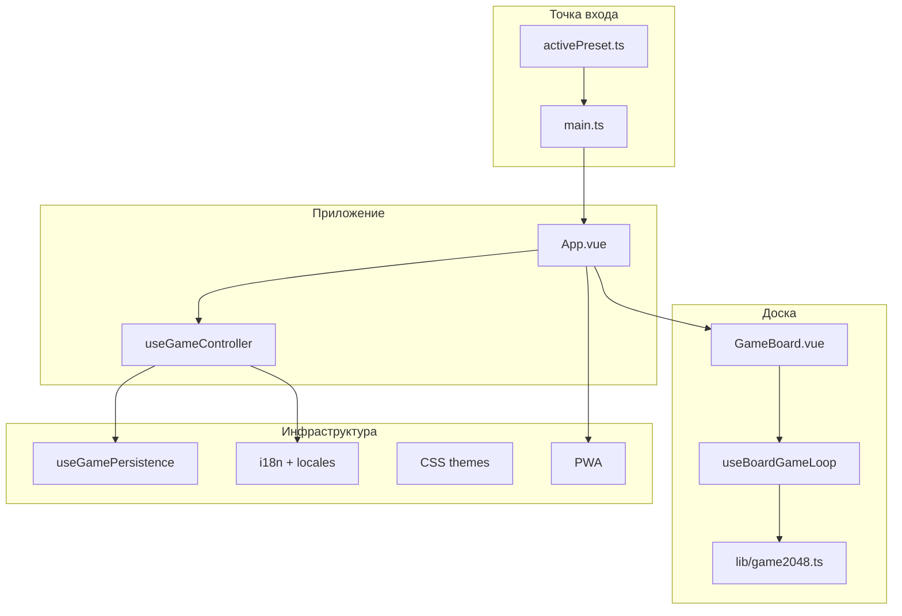

# 2048 Game (Vue 3 + TypeScript)

Классическая игра 2048 на **Vue 3**, **TypeScript** и **Vite**. Проект построен вокруг системы **пресетов**: правила, внешний вид, поведение UI и сохранение настраиваются без переписывания игровой логики.

Поддерживаются размеры поля 3×3–6×6, рекорды по размеру, награды за достижение цели, **i18n** (RU / EN / DE / IT / ES), **PWA**, восстановление сессии после перезагрузки страницы.

## Возможности

- Игровое поле 3×3, 4×4, 5×5, 6×6 с разными целями (256 … 8192)
- Клавиатура (стрелки) и свайпы на мобильных
- Анимации плиток, счёта (GSAP) и награды (`fly`)
- 8 цветовых схем UI (classic, ocean, forest, sunset + dark-варианты)
- Настройки: размер поля, тема, язык
- Сохранение в `localStorage`: рекорды, награды, настройки, **текущая партия**
- PWA: установка на домашний экран, offline-кэш, prompt обновления

## Стек

| Технология | Назначение |
|---|---|
| Vue 3 (Composition API) | UI |
| TypeScript + vue-tsc | типизация |
| Vite 5 | сборка и dev-сервер |
| vue-i18n | локализация |
| GSAP | анимация счёта |
| @iconify/vue | иконки |
| vite-plugin-pwa | Service Worker и manifest |

## Быстрый старт

```bash
npm install
npm run dev
```

Откройте http://localhost:5173/

### Другие команды

```bash
npm run build      # production-сборка в dist/
npm run preview    # предпросмотр сборки
npm run typecheck  # проверка типов (vue-tsc)
```

---

## Архитектура

Проект разделён на слои с чёткой ответственностью:



### Принципы

1. **Пресет (`GamePreset`)** — единый конфиг игры: правила, тайминги, фичи, persistence, input.
2. **Движок (`lib/game2048.ts`)** — чистый TypeScript без Vue; источник истины для правил.
3. **Composables** — бизнес-логика (сессия, счёт, input, chip-модель).
4. **Компоненты** — тонкий UI; `App.vue` и `GameBoard.vue` в основном склеивают composables.
5. **Provide/inject** — пресет и тема плиток доступны через `useGamePreset()` / `useTileTheme()`.

### Поток одного хода

```mermaid
sequenceDiagram
  participant User
  participant Input as useBoardInput
  participant Loop as useBoardGameLoop
  participant Engine as game2048.ts
  participant Chip as useBoardChipModel
  participant App as useGameController

  User->>Input: стрелка / свайп
  Input->>Loop: MoveDirection
  Loop->>Engine: left / right / up / down
  Engine-->>Loop: moves, consolidations, scoreInc
  Loop->>Chip: moveChips, deferred consolidate
  Loop->>App: score, session-update, aim-reached
  Loop->>Engine: spawnTiles, canMove?
  alt нет ходов
    Loop->>App: ended (Game over)
  end
```

---

## Точка входа

`src/main.ts`:

1. Подключает CSS тем UI и плиток.
2. Применяет начальную UI-тему из пресета (`applyUiTheme`).
3. Создаёт Vue-приложение, подключает `vue-i18n`.
4. Делает **provide** пресета и темы плиток.
5. Монтирует `App.vue`.

```ts
createApp(App)
    .use(i18n)
    .provide(gamePresetKey, activePreset)
    .provide(tileThemeKey, activePreset.tileTheme)
    .mount('#app')
```

---

## Уровень приложения (`App.vue`)

`App.vue` — layout и **слоты** для white-label кастомизации. Вся логика в **`useGameController`**:

| Composable | Назначение |
|---|---|
| `useGameMeta` | инициализация awards, bestScore, sizes |
| `useGamePersistence` | debounced save в localStorage |
| `useAppGameSession` | восстановление партии после reload |
| `useScoreDisplay` | счёт, инкремент, GSAP-анимация |
| `useAppSettings` | модалка настроек |
| `useAwards` | список наград, refs, fly-анимация |
| `useBoardLayout` | CSS-переменные layout (`--board-size`, …) |
| `useStartGameHint` | подсказка «Новая игра» |

При монтировании:

1. `loadState()` — читает `localStorage`.
2. Восстанавливает размер поля, тему, язык.
3. `restoreSavedSession()` — продолжает незавершённую партию.
4. Показывает UI.

### Слоты в `App.vue`

| Слот | Содержимое по умолчанию |
|---|---|
| `aim` | `GameAimHeader` — цель и ссылки |
| `toolbar` | `GameToolbar` — счёт, рекорд, настройки, New Game |
| `overlay` | `GameOverlay` — «Game over» |
| `board` | `GameBoard` |
| `awards` | `GameAward` × N |
| `settings` | `AppSettings` |

---

## Уровень доски (`GameBoard.vue`)

| Composable | Назначение |
|---|---|
| `useBoardGeometry` | размеры ячеек в % и px |
| `useBoardChipModel` | Vue-модель плиток (cells, keys, DOM-анимации) |
| `useBoardInput` | клавиатура + swipe |
| `useBoardGameLoop` | связь движка с UI, emit-события |

Prop **`started`** — главный переключатель:

- `true` → новая игра (или restore с `skipAutostart`).
- `false` → отключение input, emit `ended`.

### Два слоя состояния доски

1. **Движок** — числовая матрица `board[][]`, правила слияния и спавна.
2. **Chip model** — объекты `BoardChip` в `cells[]` для Vue и CSS-анимаций.

При ходе движок считает moves → chip model переносит плитки в DOM → через `deferred(animationMs)` выполняется merge и spawn.

---

## Движок (`src/lib/game2048.ts`)

Чистый TypeScript-модуль:

```ts
const game = createGame2048(size, options)

game.left()   // → { moves, consolidations, scoreInc }
game.spawnTiles(count)
game.canMove()
game.getSnapshot()   // { board, score }
game.loadSnapshot(board, score)
```

Опции спавна задаются пресетом (`spawnFourProbability`, `spawnValue`).

---

## Система пресетов

### Где настраивать

| Файл | Роль |
|---|---|
| `src/config/defaultPreset.ts` | значения по умолчанию |
| `src/config/activePreset.ts` | **ваш** активный пресет |
| `src/types/game.ts` | TypeScript-интерфейс `GamePreset` |

### Пример кастомизации

```ts
// src/config/activePreset.ts
import { createPreset } from './defaultPreset'

export const activePreset = createPreset({
  board: { defaultSize: 4 },
  timing: { animationMs: 150, moveMs: 150 },
  rules: {
    spawnsPerMove: 1,
    initialSpawns: 2,
  },
  features: {
    awardAnimation: 'none',
    scoreAnimation: 'none',
  },
  persistence: {
    storage: 'localStorage',
    key: 'game2048-state',
  },
})
```

`createPreset()` делает deep-merge поверх `defaultPreset`.

### Ключевые поля пресета

#### `board`

| Поле | Описание |
|---|---|
| `defaultSize` | размер поля по умолчанию (4) |
| `minWidthPx` / `maxWidthPx` | ограничения ширины доски |
| `horizontalWidthRatio` | доля viewport по ширине |
| `layoutVerticalPaddingPx` | вертикальные отступы layout |

#### `rules`

| Поле | Описание |
|---|---|
| `winTileBySize` | цель для каждого размера (4→2048, 5→4096, …) |
| `spawnsPerMove` | число или `(size) => number` — плиток за ход |
| `initialSpawns` | число или `(size) => number` — плиток при старте |
| `spawnFourProbability` | вероятность появления 4 (иначе 2) |

По умолчанию (не классическое 2048): `spawnsPerMove = max(1, size - 3)`, `initialSpawns = max(2, size - 2)`.

#### `timing`

| Поле | Описание |
|---|---|
| `animationMs` | длительность merge/spawn анимации |
| `moveMs` | длительность движения плиток |
| `moveEasing` | CSS easing (`ease-out`, …) |

#### `features`

| Поле | Описание |
|---|---|
| `awards` | показывать блок наград |
| `bestScorePerSize` | отдельный рекорд для каждого размера |
| `startGameHint` | пульсация кнопки «Новая игра» |
| `scoreAnimation` | `'gsap'` \| `'none'` |
| `awardAnimation` | `'fly'` \| `'none'` |

#### `persistence`

| Поле | Описание |
|---|---|
| `storage` | `'localStorage'` \| `'none'` |
| `key` | ключ в localStorage (по умолчанию `game2048-state`) |

#### `input`

| Поле | Описание |
|---|---|
| `listenKeysOn` | `'document'` \| `'board'` — где слушать клавиатуру |
| `swipeSensitivity` | чувствительность свайпа (px) |

### Доступ к пресету в коде

```ts
import { useGamePreset } from '@/composables/useGamePreset'

const preset = useGamePreset()
const { board, timing, features, rules } = preset
```

---

## Темы UI

8 схем в `src/themes/`:

- `classic`, `classic-dark`
- `ocean`, `ocean-dark`
- `forest`, `forest-dark`
- `sunset`, `sunset-dark`

Переключение: атрибут `data-theme` на `<html>` через `applyUiTheme()` (`src/config/themes.ts`). Выбор — в настройках приложения.

CSS-переменные: `--color-board`, `--color-cell`, `--color-accent`, `--color-text`, …

---

## Тема плиток

`src/config/tileThemes/default.ts` — размер шрифта по степени двойки, `getChipStyle(value, sizePx)`.

Цвета плиток — `src/themes/chips.css` (атрибут `data-value` на элементе).

В компонентах: `useTileTheme()`.

---

## Layout и адаптивность

`useBoardLayout(preset, containerRef)` вычисляет CSS-переменные на корне приложения:

- `--board-size` — адаптивная ширина доски (clamp + viewport)
- `--toolbar-height`, `--awards-height`
- `--score-font-size`, `--button-font-size`, …

Пропорции задаются в `preset.layout.ratios` (`src/composables/useBoardLayout.ts` → `defaultLayoutRatios`).

---

## Локализация (i18n)

- **Языки:** RU, EN, DE, IT, ES
- **Файлы:** `src/locales/*.ts`, тип `MessageSchema` в `src/types/messages.ts`
- **Инициализация:** `src/i18n/index.ts`

Порядок выбора языка:

1. Сохранённый в `localStorage` (из settings)
2. Язык браузера
3. Fallback: `en`

В UI языки отображаются как `RU`, `EN`, …

Добавление языка:

1. Создать `src/locales/xx.ts` с типом `MessageSchema`.
2. Добавить locale в `SUPPORTED_LOCALES` и `messages` в `src/i18n/index.ts`.
3. Расширить тип `LocaleId` в `src/types/game.ts`.

---

## Сохранение (persistence)

Ключ: `game2048-state` (настраивается в пресете).

```json
{
  "bestScore": { "4": 1234 },
  "awards": { "2048": { "aim": 2048, "obtained": true } },
  "settings": { "size": 4, "theme": "classic", "locale": "ru" },
  "session": {
    "size": 4,
    "score": 512,
    "board": [[...], [...]],
    "gameEnded": false,
    "gameAimReached": false
  }
}
```

| Механизм | Описание |
|---|---|
| Debounce 400 ms | отложенная запись при изменениях |
| `pagehide` / `visibilitychange` | немедленный flush при уходе со страницы |
| `session-update` | сохранение доски после каждого хода |
| `isValidGameSession()` | валидация перед restore (`src/lib/gameSession.ts`) |

---

## PWA

Настроено в `vite.config.ts` (`vite-plugin-pwa`):

- `registerType: 'prompt'` — пользователь решает, когда обновиться
- Precache статики, offline fallback на `index.html`
- Иконки: `public/pwa-192x192.png`, `pwa-512x512.png`, `apple-touch-icon.png`

UI обновления: `PwaUpdatePrompt.vue` + `usePwaUpdate`.

---

## Подмена компонентов

### Через пресет

```ts
import MyOverlay from './MyOverlay.vue'

export const activePreset = createPreset({
  components: {
    GameOverlay: MyOverlay,
  },
})
```

Дефолтные компоненты: `src/config/appComponents.ts`. Резолв: `useAppComponents()`.

### Через слоты

Переопределите слот в обёртке над `App.vue` или форке проекта — см. таблицу слотов выше.

---

## Структура проекта

```
src/
├── main.ts                    # bootstrap, provide preset
├── App.vue                    # layout, slots, useGameController
├── index.css                  # глобальные стили
├── env.d.ts                   # типы Vite, Vue, PWA
│
├── components/
│   ├── GameBoard.vue          # доска (geometry + chip + loop)
│   ├── GameChip.vue           # плитка с анимацией
│   ├── GameToolbar.vue        # счёт, рекорд, кнопки
│   ├── GameAimHeader.vue      # цель игры
│   ├── GameOverlay.vue        # game over
│   ├── GameAward.vue          # бейдж награды
│   ├── AppSettings.vue        # модалка настроек
│   └── PwaUpdatePrompt.vue    # prompt обновления PWA
│
├── composables/
│   ├── useGameController.ts   # фасад App
│   ├── useGamePreset.ts       # inject пресета
│   ├── useGameMeta.ts         # awards, bestScore, sizes
│   ├── useGamePersistence.ts  # localStorage
│   ├── useAppGameSession.ts   # restore сессии
│   ├── useScoreDisplay.ts     # счёт + GSAP
│   ├── useAppSettings.ts      # настройки
│   ├── useAwards.ts           # награды
│   ├── useBoardLayout.ts      # CSS layout vars
│   ├── useBoardGeometry.ts    # геометрия ячеек
│   ├── useBoardChipModel.ts   # Vue-модель плиток
│   ├── useBoardInput.ts       # keyboard + swipe
│   ├── useBoardGameLoop.ts    # игровой цикл доски
│   ├── useTileTheme.ts        # тема плиток
│   ├── useAppComponents.ts    # компоненты из пресета
│   ├── useAwardAnimation.ts   # fly-анимация награды
│   ├── useStartGameHint.ts    # hint на New Game
│   └── usePwaUpdate.ts        # PWA update prompt
│
├── config/
│   ├── activePreset.ts        # ← ваш пресет
│   ├── defaultPreset.ts       # defaults + createPreset()
│   ├── themes.ts              # UI themes registry
│   ├── appComponents.ts       # default components map
│   ├── injectionKeys.ts       # provide/inject keys
│   └── tileThemes/default.ts  # стили плиток
│
├── lib/
│   ├── game2048.ts            # движок игры
│   ├── gameSession.ts         # валидация сессии
│   ├── deferred.ts            # отложенный callback (анимации)
│   └── swipe.ts                 # swipe listener
│
├── i18n/index.ts
├── locales/                   # en, ru, de, it, es
├── themes/                    # CSS color schemes
├── types/
│   ├── game.ts                # GamePreset, GameSession, …
│   ├── messages.ts            # MessageSchema (i18n)
│   ├── settings.ts            # SettingsSavePayload
│   └── components.ts          # expose-типы компонентов
└── icons.ts                   # Iconify icons

public/                        # favicon, PWA icons
vite.config.ts                 # Vite + PWA
tsconfig.json                  # TypeScript
```

---

## TypeScript

- Строгий режим: `strict: true`
- Проверка: `npm run typecheck` (`vue-tsc`)
- Типы игры: `src/types/game.ts`
- Vue SFC: `<script setup lang="ts">`

Path alias `@/*` → `src/*` настроен в `tsconfig.json` (опционально для импортов).

---

## Лицензия

[MIT](LICENSE) © 2026 Dmitriy Shalberkin
