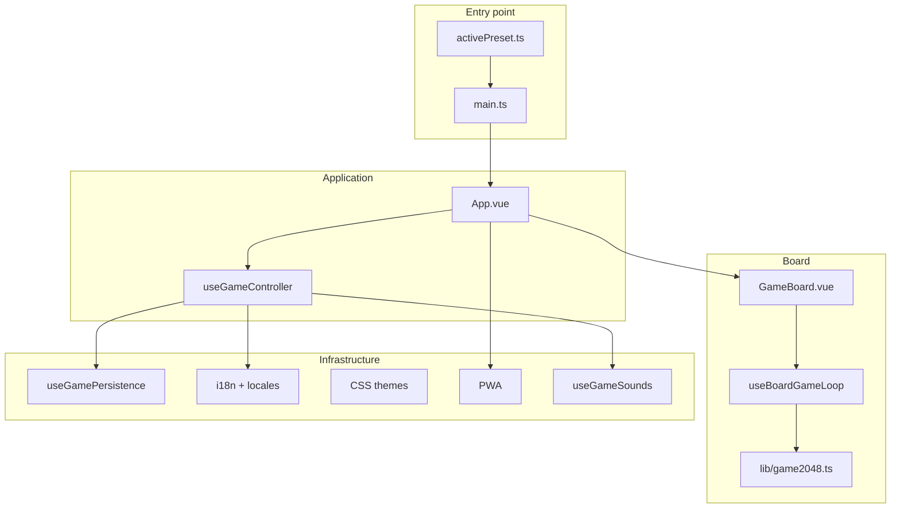

# 2048 Game (Vue 3 + TypeScript)

A classic 2048 game built with **Vue 3**, **TypeScript**, and **Vite**. The project is organized around a **preset** system: rules, appearance, UI behavior, and persistence can be customized without rewriting the core game logic.

Supports board sizes from 3×3 to 6×6, per-size high scores, goal achievements, **i18n** (RU / EN / DE / IT / ES), **PWA**, session restore after page reload, and **sound effects**.

## Features

- Board sizes 3×3, 4×4, 5×5, and 6×6 with different win targets (256 … 8192)
- Keyboard (arrow keys) and swipe controls on mobile
- Tile, animated score counter, and award (`fly`) animations
- Sound effects for moves, merges, spawns, win, and game over (toggle in settings)
- 8 UI color schemes (classic, ocean, forest, sunset + dark variants)
- Settings: board size, theme, language, sound on/off
- `localStorage` persistence: high scores, awards, settings, and **current game session**
- PWA: add to home screen, offline cache, update prompt

## Tech stack

| Technology | Purpose |
|---|---|
| Vue 3 (Composition API) | UI |
| TypeScript + vue-tsc | Type checking |
| Vite 5 | Build tool and dev server |
| vue-i18n | Localization |
| Web Audio API | Sound effects |
| @iconify/vue | Icons |
| vite-plugin-pwa | Service Worker and manifest |

## Quick start

```bash
npm install
npm run dev
```

Open http://localhost:5173/

### Other commands

```bash
npm run build            # production build to dist/
npm run preview          # preview production build
npm run typecheck        # type check (vue-tsc)
npm run generate:sounds  # generate procedural WAV assets (runs on prebuild)
```

---

## Architecture

The project is split into layers with clear responsibilities:



### Principles

1. **Preset (`GamePreset`)** — single game config: rules, timings, features, persistence, input.
2. **Engine (`lib/game2048.ts`)** — pure TypeScript without Vue; source of truth for game rules.
3. **Composables** — business logic (session, score, input, chip model, sounds).
4. **Components** — thin UI; `App.vue` and `GameBoard.vue` mostly wire composables together.
5. **Provide/inject** — preset and tile theme available via `useGamePreset()` / `useTileTheme()`.

### Turn flow

```mermaid
sequenceDiagram
  participant User
  participant Input as useBoardInput
  participant Loop as useBoardGameLoop
  participant Engine as game2048.ts
  participant Chip as useBoardChipModel
  participant App as useGameController

  User->>Input: arrow key / swipe
  Input->>Loop: MoveDirection
  Loop->>Engine: left / right / up / down
  Engine-->>Loop: moves, consolidations, scoreInc
  Loop->>Chip: moveChips, deferred consolidate
  Loop->>App: score, session-update, aim-reached
  Loop->>Engine: spawnTiles, canMove?
  alt no moves left
    Loop->>App: ended (Game over)
  end
```

---

## Entry point

`src/main.ts`:

1. Loads UI and tile theme CSS.
2. Applies the initial UI theme from the preset (`applyUiTheme`).
3. Creates the Vue app and registers `vue-i18n`.
4. **Provides** the preset and tile theme.
5. Mounts `App.vue`.

```ts
createApp(App)
    .use(i18n)
    .provide(gamePresetKey, activePreset)
    .provide(tileThemeKey, activePreset.tileTheme)
    .mount('#app')
```

---

## Application layer (`App.vue`)

`App.vue` is the layout and **slots** for white-label customization. All logic lives in **`useGameController`**:

| Composable | Purpose |
|---|---|
| `useGameMeta` | Initialize awards, bestScore, sizes |
| `useGamePersistence` | Debounced save to localStorage |
| `useAppGameSession` | Restore game session after reload |
| `useScoreDisplay` | Score, increment display, count-up animation |
| `useAppSettings` | Settings modal |
| `useAwards` | Award list, refs, fly animation |
| `useBoardLayout` | Layout CSS variables (`--board-size`, …) |
| `useStartGameHint` | "New Game" button hint |
| `useGameSounds` | Sound effects (move, merge, spawn, win, game over) |

On mount:

1. `loadState()` — reads `localStorage`.
2. Restores board size, theme, language, and sound preference.
3. `restoreSavedSession()` — resumes an unfinished game.
4. Shows the UI.

### Slots in `App.vue`

| Slot | Default content |
|---|---|
| `aim` | `GameAimHeader` — goal and links |
| `toolbar` | `GameToolbar` — score, best, settings, New Game |
| `overlay` | `GameOverlay` — "Game over" |
| `board` | `GameBoard` |
| `awards` | `GameAward` × N |
| `settings` | `AppSettings` |
| `copyright` | `AppCopyright` |

---

## Board layer (`GameBoard.vue`)

| Composable | Purpose |
|---|---|
| `useBoardGeometry` | Cell sizes in % and px |
| `useBoardChipModel` | Vue tile model (cells, keys, DOM animations) |
| `useBoardInput` | Keyboard + swipe |
| `useBoardGameLoop` | Engine ↔ UI bridge, emit events |

The **`started`** prop is the main switch:

- `true` → new game (or restore with `skipAutostart`).
- `false` → disable input, emit `ended`.

### Two layers of board state

1. **Engine** — numeric `board[][]` matrix, merge and spawn rules.
2. **Chip model** — `BoardChip` objects in `cells[]` for Vue and CSS animations.

On each turn: the engine computes moves → the chip model moves tiles in the DOM → merge and spawn run after `deferred(animationMs)`.

---

## Engine (`src/lib/game2048.ts`)

Pure TypeScript module:

```ts
const game = createGame2048(size, options)

game.left()   // → { moves, consolidations, scoreInc }
game.spawnTiles(count)
game.canMove()
game.getSnapshot()   // { board, score }
game.loadSnapshot(board, score)
```

Spawn options come from the preset (`spawnFourProbability`, `spawnValue`).

---

## Preset system

### Where to configure

| File | Role |
|---|---|
| `src/config/defaultPreset.ts` | Default values |
| `src/config/activePreset.ts` | **Your** active preset |
| `src/types/game.ts` | TypeScript `GamePreset` interface |

### Customization example

```ts
// src/config/activePreset.ts
import { createPreset } from './defaultPreset'

export const activePreset = createPreset({
  board: { defaultSize: 4 },
  timing: { animationMs: 150, moveMs: 150 },
  rules: {
    spawnsPerMove: 1,
    initialSpawns: 2,
  },
  features: {
    awardAnimation: 'none',
    sounds: 'none',
  },
  persistence: {
    storage: 'localStorage',
    key: 'game2048-state',
  },
})
```

`createPreset()` deep-merges on top of `defaultPreset`.

### Key preset fields

#### `board`

| Field | Description |
|---|---|
| `defaultSize` | Default board size (4) |
| `minWidthPx` / `maxWidthPx` | Board width constraints |
| `horizontalWidthRatio` | Viewport width fraction |
| `layoutVerticalPaddingPx` | Vertical layout padding |

#### `rules`

| Field | Description |
|---|---|
| `winTileBySize` | Win target per size (4→2048, 5→4096, …) |
| `spawnsPerMove` | Number or `(size) => number` — tiles spawned per move |
| `initialSpawns` | Number or `(size) => number` — tiles at game start |
| `spawnFourProbability` | Probability of spawning 4 (otherwise 2) |

Default (non-classic 2048): `spawnsPerMove = max(1, size - 3)`, `initialSpawns = max(2, size - 2)`.

#### `timing`

| Field | Description |
|---|---|
| `animationMs` | Merge/spawn animation duration |
| `moveMs` | Tile movement duration |
| `moveEasing` | CSS easing (`ease-out`, …) |
| `scoreAnimationMs` | Score and best-score count-up duration (default `200`) |

#### `features`

| Field | Description |
|---|---|
| `awards` | Show awards block |
| `bestScorePerSize` | Separate high score per board size |
| `startGameHint` | Pulse animation on "New Game" button |
| `awardAnimation` | `'fly'` \| `'none'` |
| `sounds` | `'default'` \| `'none'` — enable or disable sound effects |
| `soundVolume` | Master volume 0…1 (default `0.6`) |

#### `persistence`

| Field | Description |
|---|---|
| `storage` | `'localStorage'` \| `'none'` |
| `key` | localStorage key (default `game2048-state`) |

#### `input`

| Field | Description |
|---|---|
| `listenKeysOn` | `'document'` \| `'board'` — where to listen for keyboard |
| `swipeSensitivity` | Swipe sensitivity (px) |

### Accessing the preset in code

```ts
import { useGamePreset } from '@/composables/useGamePreset'

const preset = useGamePreset()
const { board, timing, features, rules } = preset
```

---

## UI themes

8 schemes in `src/themes/`:

- `classic`, `classic-dark`
- `ocean`, `ocean-dark`
- `forest`, `forest-dark`
- `sunset`, `sunset-dark`

Switching: `data-theme` attribute on `<html>` via `applyUiTheme()` (`src/config/themes.ts`). Selection is in app settings.

CSS variables: `--color-board`, `--color-cell`, `--color-accent`, `--color-text`, …

---

## Tile theme

`src/config/tileThemes/default.ts` — font size by power of two, `getChipStyle(value, sizePx)`.

Tile colors — `src/themes/chips.css` (`data-value` attribute on the element).

In components: `useTileTheme()`.

---

## Layout and responsiveness

`useBoardLayout(preset, containerRef)` computes CSS variables on the app root:

- `--board-size` — adaptive board width (clamp + viewport)
- `--toolbar-height`, `--awards-height`
- `--score-font-size`, `--button-font-size`, …

Ratios are defined in `preset.layout.ratios` (`src/composables/useBoardLayout.ts` → `defaultLayoutRatios`).

---

## Localization (i18n)

- **Languages:** RU, EN, DE, IT, ES
- **Files:** `src/locales/*.ts`, `MessageSchema` type in `src/types/messages.ts`
- **Setup:** `src/i18n/index.ts`

Language selection order:

1. Saved in `localStorage` (from settings)
2. Browser language
3. Fallback: `en`

Languages are shown in the UI as `RU`, `EN`, …

Adding a language:

1. Create `src/locales/xx.ts` with the `MessageSchema` type.
2. Add the locale to `SUPPORTED_LOCALES` and `messages` in `src/i18n/index.ts`.
3. Extend the `LocaleId` type in `src/types/game.ts`.

---

## Sound effects

Sounds are procedurally generated WAV files in `public/sounds/`, created by `scripts/generate-sounds.mjs` (runs automatically on `prebuild`).

Playback uses the Web Audio API (`src/lib/audio/soundPlayer.ts`) with pitch scaling for merges based on tile value.

| Event | When |
|---|---|
| Move | Tiles slide after a valid move |
| Merge | After merge animation (pitch rises with tile value) |
| Spawn | New tile appears |
| Win | Goal tile reached |
| Game over | No moves left |

Sounds can be disabled in settings (`soundEnabled`) or globally via the preset (`features.sounds: 'none'`). Audio unlocks on the first user gesture (keyboard or swipe) due to browser autoplay policies.

---

## Persistence

Key: `game2048-state` (configurable in the preset).

```json
{
  "bestScore": { "4": 1234 },
  "awards": { "2048": { "aim": 2048, "obtained": true } },
  "settings": { "size": 4, "theme": "classic", "locale": "ru", "soundEnabled": true },
  "session": {
    "size": 4,
    "score": 512,
    "board": [[...], [...]],
    "gameEnded": false,
    "gameAimReached": false
  }
}
```

| Mechanism | Description |
|---|---|
| Debounce 400 ms | Deferred write on changes |
| `pagehide` / `visibilitychange` | Immediate flush when leaving the page |
| `session-update` | Save board state after each move |
| `isValidGameSession()` | Validation before restore (`src/lib/gameSession.ts`) |

---

## PWA

Configured in `vite.config.ts` (`vite-plugin-pwa`):

- `registerType: 'prompt'` — user chooses when to update
- Precache static assets, offline fallback to `index.html`
- Icons: `public/pwa-192x192.png`, `pwa-512x512.png`, `apple-touch-icon.png`
- Audio files included in Workbox precache for offline play

Update UI: `PwaUpdatePrompt.vue` + `usePwaUpdate`.  
Install hint: `PwaInstallPrompt.vue` + `usePwaInstall`.

---

## Component overrides

### Via preset

```ts
import MyOverlay from './MyOverlay.vue'

export const activePreset = createPreset({
  components: {
    GameOverlay: MyOverlay,
  },
})
```

Default components: `src/config/appComponents.ts`. Resolution: `useAppComponents()`.

### Via slots

Override a slot in a wrapper around `App.vue` or in a project fork — see the slots table above.

---

## Project structure

```
src/
├── main.ts                    # bootstrap, provide preset
├── App.vue                    # layout, slots, useGameController
├── index.css                  # global styles
├── env.d.ts                   # Vite, Vue, PWA types
│
├── components/
│   ├── GameBoard.vue          # board (geometry + chip + loop)
│   ├── GameChip.vue           # animated tile
│   ├── GameToolbar.vue        # score, best, buttons
│   ├── GameAimHeader.vue      # game goal
│   ├── GameOverlay.vue        # game over
│   ├── GameAward.vue          # award badge
│   ├── AppSettings.vue        # settings modal
│   ├── AppCopyright.vue       # footer copyright
│   ├── PwaUpdatePrompt.vue    # PWA update prompt
│   └── PwaInstallPrompt.vue   # PWA install hint
│
├── composables/
│   ├── useGameController.ts   # App facade
│   ├── useGamePreset.ts       # preset inject
│   ├── useGameMeta.ts         # awards, bestScore, sizes
│   ├── useGamePersistence.ts  # localStorage
│   ├── useAppGameSession.ts   # session restore
│   ├── useScoreDisplay.ts     # score + count-up animation
│   ├── useAppSettings.ts      # settings
│   ├── useAwards.ts           # awards
│   ├── useGameSounds.ts       # sound effects
│   ├── useBoardLayout.ts      # CSS layout vars
│   ├── useBoardGeometry.ts    # cell geometry
│   ├── useBoardChipModel.ts   # Vue tile model
│   ├── useBoardInput.ts       # keyboard + swipe
│   ├── useBoardGameLoop.ts    # board game loop
│   ├── useTileTheme.ts        # tile theme
│   ├── useAppComponents.ts    # preset components
│   ├── useAwardAnimation.ts   # fly award animation
│   ├── useStartGameHint.ts    # New Game hint
│   ├── usePwaUpdate.ts        # PWA update prompt
│   └── usePwaInstall.ts       # PWA install hint
│
├── config/
│   ├── activePreset.ts        # ← your preset
│   ├── defaultPreset.ts       # defaults + createPreset()
│   ├── themes.ts              # UI themes registry
│   ├── appComponents.ts       # default components map
│   ├── injectionKeys.ts       # provide/inject keys
│   └── tileThemes/default.ts  # tile styles
│
├── lib/
│   ├── game2048.ts            # game engine
│   ├── gameSession.ts         # session validation
│   ├── deferred.ts            # deferred callback (animations)
│   ├── swipe.ts               # swipe listener
│   └── audio/
│       ├── soundPlayer.ts     # Web Audio playback
│       └── soundMap.ts        # sound URLs and merge pitch
│
├── i18n/index.ts
├── locales/                   # en, ru, de, it, es
├── themes/                    # CSS color schemes
├── types/
│   ├── game.ts                # GamePreset, GameSession, …
│   ├── messages.ts            # MessageSchema (i18n)
│   ├── settings.ts            # SettingsSavePayload
│   └── components.ts          # component expose types
└── icons.ts                   # Iconify icons

public/
├── sounds/                    # procedural WAV assets
├── favicon, PWA icons

scripts/
├── generate-pwa-assets.mjs
└── generate-sounds.mjs

vite.config.ts                 # Vite + PWA
tsconfig.json                  # TypeScript
```

---

## TypeScript

- Strict mode: `strict: true`
- Check: `npm run typecheck` (`vue-tsc`)
- Game types: `src/types/game.ts`
- Vue SFC: `<script setup lang="ts">`

Path alias `@/*` → `src/*` is configured in `tsconfig.json` (optional for imports).

---

## Releases

Version history is in [CHANGELOG.md](CHANGELOG.md).

### Creating a release

1. Merge changes to `master`
2. `npm run typecheck && npm run build`
3. `npm run release` (or `release:patch` / `release:minor` / `release:major`)
4. `git push --follow-tags origin master`
5. `gh release create vX.Y.Z --title "vX.Y.Z" --notes "<section from CHANGELOG>"`

---

## Acknowledgments

Inspired by the original [2048](https://github.com/gabrielecirulli/2048) by Gabriele Cirulli (MIT).

---

## License

[MIT](LICENSE) © 2026 Dmitriy Shalberkin
